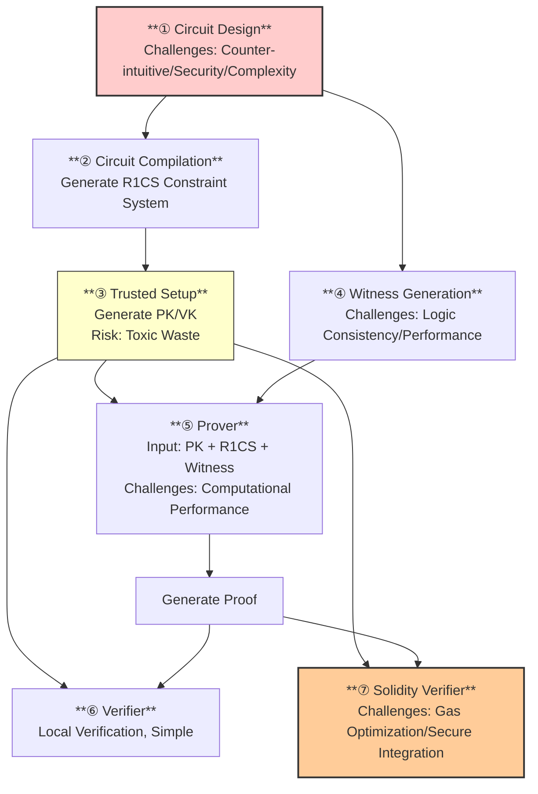
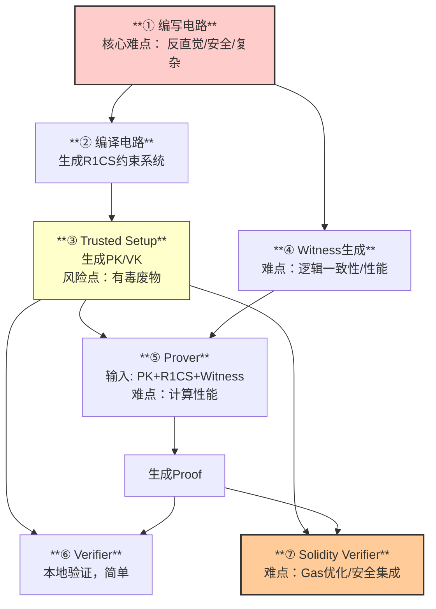

```mermaid
graph TD
    A[**① Circuit Design**<br/>Challenges: Counter-intuitive/Security/Complexity] --> B[**② Circuit Compilation**<br/>Generate R1CS Constraint System]
    B --> C[**③ Trusted Setup**<br/>Generate PK/VK<br/>Risk: Toxic Waste]
    A --> D[**④ Witness Generation**<br/>Challenges: Logic Consistency/Performance]
    C --> E[**⑤ Prover**<br/>Input: PK + R1CS + Witness<br/>Challenges: Computational Performance]
    D --> E
    E --> F[Generate Proof]
    C --> G[**⑥ Verifier**<br/>Local Verification, Simple]
    F --> G
    C --> H[**⑦ Solidity Verifier**<br/>Challenges: Gas Optimization/Secure Integration]
    F --> H

    style A fill:#ffcccc,stroke:#333,stroke-width:2px
    style H fill:#ffcc99,stroke:#333,stroke-width:2px
    style C fill:#ffffcc,stroke:#333,stroke-width:1px
```

```mermaid
graph TD
    A[**① 编写电路**<br/>核心难点： 反直觉/安全/复杂] --> B[**② 编译电路**<br/>生成R1CS约束系统]
    B --> C[**③ Trusted Setup**<br/>生成PK/VK<br/>风险点：有毒废物]
    A --> D[**④ Witness生成**<br/>难点：逻辑一致性/性能]
    C --> E[**⑤ Prover**<br/>输入: PK+R1CS+Witness<br/>难点：计算性能]
    D --> E
    E --> F[生成Proof]
    C --> G[**⑥ Verifier**<br/>本地验证，简单]
    F --> G
    C --> H[**⑦ Solidity Verifier**<br/>难点：Gas优化/安全集成]
    F --> H

    style A fill:#ffcccc,stroke:#333,stroke-width:2px
    style H fill:#ffcc99,stroke:#333,stroke-width:2px
    style C fill:#ffffcc,stroke:#333,stroke-width:1px
```
