```mermaid
graph TD
    A[**① Circuit Design**<br/>Challenges: Counter-intuitive/Security/Complexity] --> B[**② Circuit Compilation**<br/>Generate R1CS Constraint System]
    B --> C[**③ Trusted Setup**<br/>Generate PK/VK<br/>Risk: Toxic Waste]
    A --> D[**④ Witness Generation**<br/>Challenges: Logic Consistency/Performance]
    C --> E[**⑤ Prover**<br/>Input: PK + R1CS + Witness<br/>Challenges: Computational Performance]
    D --> E
    E --> F[Generate Proof]
    C --> G[**⑥ Verifier**<br/>Local Verification, Simple]
    F --> G
    C --> H[**⑦ Solidity Verifier**<br/>Challenges: Gas Optimization/Secure Integration]
    F --> H

    style A fill:#ffcccc,stroke:#333,stroke-width:2px
    style H fill:#ffcc99,stroke:#333,stroke-width:2px
    style C fill:#ffffcc,stroke:#333,stroke-width:1px
```

```mermaid
graph TD
    A[**① 编写电路**<br/>核心难点： 反直觉/安全/复杂] --> B[**② 编译电路**<br/>生成R1CS约束系统]
    B --> C[**③ Trusted Setup**<br/>生成PK/VK<br/>风险点：有毒废物]
    A --> D[**④ Witness生成**<br/>难点：逻辑一致性/性能]
    C --> E[**⑤ Prover**<br/>输入: PK+R1CS+Witness<br/>难点：计算性能]
    D --> E
    E --> F[生成Proof]
    C --> G[**⑥ Verifier**<br/>本地验证，简单]
    F --> G
    C --> H[**⑦ Solidity Verifier**<br/>难点：Gas优化/安全集成]
    F --> H

    style A fill:#ffcccc,stroke:#333,stroke-width:2px
    style H fill:#ffcc99,stroke:#333,stroke-width:2px
    style C fill:#ffffcc,stroke:#333,stroke-width:1px
```

Here's the complete English translation for your GitHub Markdown document:

---

## 🏆 **Highest Difficulty: Circuit Writing (Circom)**

This is the biggest and most fundamental challenge—the "foundation" of the entire system. If there are errors here, all subsequent steps become futile.

**Counter-intuitive Programming Paradigm:**

- **Non-Turing Complete:** Circom is a domain-specific language for describing constraints, not a general-purpose programming language. You cannot write dynamic logic with for-loops; all loops must be "unrolled."
- **Stateless, No Variables:** All signal values are "static" and must be declared and connected in one go. You cannot compute things step-by-step like in normal programming ("compute this first, then that").
- **Arithmetic Circuit Mindset:** All operations must ultimately be translated into arithmetic operations (addition, multiplication, modulo) in a finite field. Simple operations like `if-else`, comparisons `a > b`, hashing, or signature verification need to be broken down into numerous multiplication constraints, making them extremely complex.

**Security and Logic Vulnerabilities:**

- **Arithmetic Overflow:** All operations occur within a finite field (usually modulo a prime number). When `x + y > p`, it "wraps around," leading to completely incorrect logic.
- **Constraint Completeness:** Forgetting to add a necessary constraint allows attackers to submit invalid witnesses that still pass verification. For example, if you prove knowledge of a square root but forget to constrain the number to be non-negative, attackers could use the square root of a negative number and still pass.
- **Side-channel Constraints:** Circuits may inadvertently leak information. For instance, the number or structure of constraints might vary based on public inputs, potentially revealing private information.

**Massive Engineering Complexity:**

- **Poor Code Readability and Maintainability:** Complex business logic (like a complete DEX transaction) can generate millions of constraints, making circuit code difficult to understand.
- **Third-party Template Risks:** Heavy reliance on un-audited third-party circomlib templates (for hash functions, signature verification, etc.) that may contain vulnerabilities themselves.

In short: Writing correct, secure, and efficient circuits is a blend of art, science, and hard labor—the greatest cognitive and engineering barrier.

## 🥈 **Second Highest Difficulty: Solidity Verifier (On-chain Verification)**

This is the critical leap from cryptographic theory to production, directly confronting blockchain's stringent constraints.

**Gas Cost Optimization:**

- Groth16 verification requires performing elliptic curve pairings and scalar multiplications on-chain, which is extremely gas-intensive.
- Core challenge: How to optimize the verification contract to reduce gas to acceptable levels (e.g., <500K gas), requiring deep understanding of elliptic curve cryptography and EVM assembly.
- May require custom compression and precomputation of the verification key (VK).

**Interface and Secure Integration:**

- Careful design of contract interfaces is needed to safely pass public inputs and proofs.
- Must ensure the verification logic perfectly matches the circuit design—a single byte error could cause verification failure or bypass.
- Must guard against verification-related smart contract vulnerabilities like reentrancy and access control issues.

## 🥉 **Medium Difficulty: Witness Generation**

This is the bridge connecting the real world to the circuit world.

**Correctness:** Must compute all intermediate signal values using exactly the same logic and order as the circuit, in a regular programming environment. If the circuit uses a specific hash function, the witness generator must implement it precisely.

**Performance:** For complex circuits, witness generation itself can be computationally intensive and requires optimization.

**Data Sources:** How to securely and trustlessly obtain private inputs needed for witness generation (e.g., private keys) is a system design challenge.

## 📚 **Lower but Critical Difficulty: Circuit Compilation & Trusted Setup & Prover/Verifier**

These stages have relatively concentrated technical challenges with mature tools and theories, but still contain pitfalls.

**Circuit Compilation:**

- Main challenge: Is the resulting R1CS constraint system optimal? The number of constraints directly impacts proof generation time and trusted setup duration. Sometimes manual optimization of circuit structure is needed to reduce constraints.

**Trusted Setup (Required for Groth16):**

- The difficulty lies not in execution but in ceremony and organization. How to ensure "toxic waste" is completely destroyed? This relies on multi-party computation ceremonies.
- Engineering challenge: For large circuits, the ceremony itself is computationally heavy and may require distributed computing.
- Core risk: If the setup is compromised, attackers can forge proofs for anything, completely collapsing the system. Thus, it's a single point of failure.

**Prover/Verifier (Local):**

- Prover's main difficulty is performance: Proof generation is the most computationally intensive step (may take seconds to hours). Optimization strategies include GPU/FPGA acceleration and optimizing proof algorithm implementation.
- Verifier (local) has almost no difficulty: Verification is extremely fast (milliseconds), which is a major advantage of Groth16.

---

