<!-- Zero-Knowledge Proof System Development: A Comprehensive Challenge Analysis -->

<!-- 
多行注释
可以这样写
-->

<!-- 注释可以放在内容中间：这是前面的内容 -->

<!-- 这是后面的注释 -->

# ZK-SNARK System Development: Challenges Analysis

## 📊 Overview: End-to-End ZK Proof System Workflow

```mermaid
graph TD
    A[**① Circuit Design**<br/>Challenges: Counter-intuitive/Security/Complexity] --> B[**② Circuit Compilation**<br/>Generate R1CS Constraint System]
    B --> C[**③ Trusted Setup**<br/>Generate PK/VK<br/>Risk: Toxic Waste]
    A --> D[**④ Witness Generation**<br/>Challenges: Logic Consistency/Performance]
    C --> E[**⑤ Prover**<br/>Input: PK + R1CS + Witness<br/>Challenges: Computational Performance]
    D --> E
    E --> F[Generate Proof]
    C --> G[**⑥ Verifier**<br/>Local Verification, Simple]
    F --> G
    C --> H[**⑦ Solidity Verifier**<br/>Challenges: Gas Optimization/Secure Integration]
    F --> H

    style A fill:#ffcccc,stroke:#333,stroke-width:2px
    style H fill:#ffcc99,stroke:#333,stroke-width:2px
    style C fill:#ffffcc,stroke:#333,stroke-width:1px
```



---

## 🏆 **Highest Difficulty: Circuit Design (Circom)**

### 🎯 **Core Challenge**
The circuit design phase is the **foundation** of the entire ZK system. Errors at this stage render all subsequent steps futile.

### 🔄 **Counter-intuitive Programming Paradigm**

| Aspect | Challenge | Impact |
|--------|-----------|--------|
| **Non-Turing Complete** | Circom is a constraint-description DSL, not a general-purpose language. No dynamic loops—all must be "unrolled". | Limits algorithmic flexibility |
| **Stateless Architecture** | All signals are static; must be declared and connected in one pass. No step-by-step computation. | Increases design complexity |
| **Arithmetic Circuit Mindset** | Every operation reduces to finite field arithmetic (addition, multiplication, modulo). | Simple operations become complex |

### ⚠️ **Security and Logic Vulnerabilities**

#### **Arithmetic Overflow**
```javascript
// In finite field (mod p)
// If x + y > p, result "wraps around"
// This can lead to completely incorrect logic
```

#### **Constraint Completeness**
- **Missing constraint example**: Proving square root knowledge without non-negativity constraint
- **Attack vector**: Attackers use negative square roots to pass verification
- **Impact**: Complete system compromise

#### **Side-channel Constraints**
- Circuit structure may vary with public inputs
- Constraint count differences can leak private information

### 🏗️ **Engineering Complexity**

| Issue | Description | Mitigation Strategy |
|-------|-------------|---------------------|
| **Poor Code Readability** | Complex circuits generate millions of constraints | Modular design, thorough documentation |
| **Maintenance Challenges** | Circuit code resembles "mathematical hieroglyphics" | Version control, code review processes |
| **Third-party Template Risks** | Unaudited circomlib templates may contain vulnerabilities | Audit dependencies, implement fallbacks |

> **Summary**: Circuit design is a blend of cryptography, mathematics, and software engineering—the single greatest barrier in ZK system development.

---

## 🥈 **Second Highest Difficulty: Solidity Verifier (On-chain)**

### ⛽ **Gas Cost Optimization Challenge**

| Operation | Gas Cost | Optimization Strategy |
|-----------|----------|-----------------------|
| Elliptic Curve Pairing | ~200K-400K gas | Precomputation, batch verification |
| Scalar Multiplication | ~50K-100K gas | Custom VK compression |
| Overall Verification | Target: <500K gas | Assembly optimization |

### 🔧 **Technical Implementation**

```solidity
// Example: Optimized verification interface
contract ZKVerifier {
    // Custom gas-efficient verification
    function verifyProof(
        uint[2] memory a,
        uint[2][2] memory b,
        uint[2] memory c,
        uint[] memory inputs
    ) public returns (bool) {
        // Optimized implementation
    }
}
```

### 🔒 **Security Integration**

| Security Consideration | Implementation Details |
|------------------------|------------------------|
| **Interface Design** | Safe input validation, proof format checking |
| **Logic Consistency** | Byte-perfect match with circuit constraints |
| **Contract Vulnerabilities** | Reentrancy, access control, overflow checks |

---

## 🥉 **Medium Difficulty: Witness Generation**

### 🌉 **The Bridge Between Worlds**

#### **Correctness Requirements**
- **Exact logical match** with circuit computation
- **Identical operation order** and arithmetic
- **Precise implementation** of all cryptographic primitives

#### **Performance Considerations**
```javascript
// Witness generation for complex circuits
// May require:
// - Parallel processing
// - Memory optimization
// - Algorithmic improvements
```

#### **Data Source Security**
- **Private key management** for signature-based witnesses
- **Trustless data oracles** for external inputs
- **Secure computation environments**

---

## 📚 **Lower but Critical Challenges**

### 🔧 **Circuit Compilation**
- **Optimization target**: Minimize R1CS constraint count
- **Challenge**: Automatic vs. manual optimization trade-offs
- **Impact**: Directly affects prover performance and setup time

### 🎭 **Trusted Setup Ceremony**
| Risk Factor | Mitigation Strategy |
|-------------|---------------------|
| **Toxic Waste Generation** | Multi-party computation ceremonies |
| **Single Point of Failure** | Distributed setup, ceremony transparency |
| **Computational Intensity** | Cloud/distributed computing resources |

### ⚡ **Prover Performance**
- **Bottleneck**: Proof generation time (seconds to hours)
- **Optimization strategies**:
  - GPU/FPGA acceleration
  - Parallel computation
  - Algorithmic improvements (FFT optimization)

### ✅ **Local Verifier**
- **Strength**: Milliseconds verification time
- **Simplicity**: Straightforward implementation
- **Reliability**: Mature mathematical foundations

---

## 📈 **Difficulty Comparison Matrix**

| Phase | Difficulty Level | Key Challenges | Mitigation Strategies |
|-------|-----------------|----------------|------------------------|
| **Circuit Design** | 🏆 Highest | Counter-intuitive paradigm, security vulnerabilities | Formal verification, extensive testing |
| **Solidity Verifier** | 🥈 High | Gas optimization, secure integration | Assembly optimization, VK compression |
| **Witness Generation** | 🥉 Medium | Correctness, performance, data sourcing | Automated testing, performance profiling |
| **Other Components** | 📚 Lower | Optimization, ceremony management | Toolchain improvements, transparent ceremonies |

---

## 🛠️ **Best Practices Summary**

1. **Start Simple**: Begin with minimal circuits and expand gradually
2. **Test Thoroughly**: Implement comprehensive test suites for each component
3. **Security First**: Assume vulnerabilities exist and design defensively
4. **Performance Profile**: Identify bottlenecks early in development
5. **Document Everything**: Maintain detailed records of design decisions and constraints

---

## 📚 **Further Resources**

### Essential Tools
- **Circom**: Circuit compiler and DSL
- **SnarkJS**: JavaScript implementation of zk-SNARK schemes
- **Circomlib**: Community circuit library (use with caution)

### Learning Path
1. Basic arithmetic circuits
2. Hash functions and digital signatures
3. Complex business logic implementation
4. Gas optimization techniques
5. Production deployment strategies

---

*Last Updated: $(date)*  
*Author: [Your Name/Team]*  
*License: [Specify License]*
